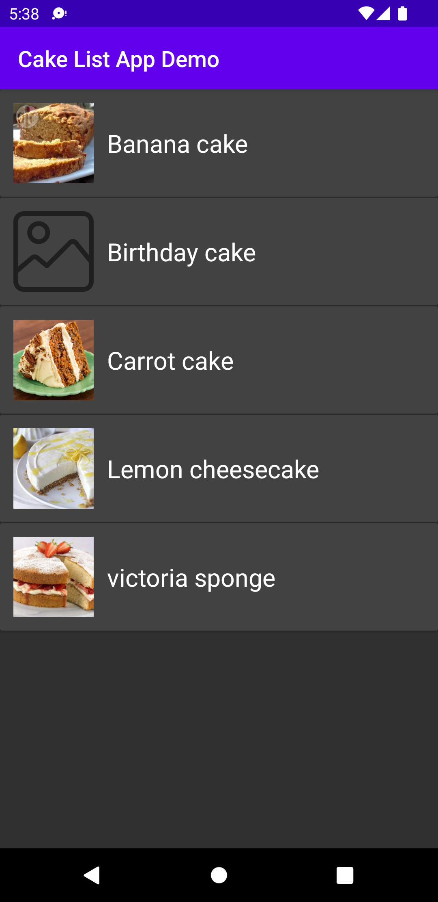

# CakeListAndroidApp
The application loads and displays a list of cakes and apply filter on items. There is also pull to refresh feature and refresh option when service gets error.
MVVM design pattern with Jetpack, Hilt, Coroutine, Lifecycle Components, Retrofit, Glide and Mockito libraries have used.
Unit tests implemented with junit and mockito libraries.

## Libraries
*   [AndroidX](https://developer.android.com/jetpack/androidx)  Android Architecture Components:
    ViewModel ,
    LiveData,
    Swipe Refresh
*   [Hilt](https://github.com/googlecodelabs/android-hilt)
*   [Coroutines](https://github.com/Kotlin/kotlinx.coroutines)
*   [OkHttp](http://square.github.io/okhttp/)
*   [Retrofit](http://square.github.io/retrofit/)
*   [Gson](https://github.com/google/gson)
*   [Mockito](https://github.com/mockito/mockito)

## Approach of Clean Architecture for Android
The whole application is built based on the MVVM architectural pattern.There are 3 separated  layers in the project:App, Data, Domain

## Requirements &amp; configurations
#### Requirements
- JDK 8
- Android SDK API 31
- Kotlin Gradle plugin 1.3.61 *(it will be installed automatically when this project is synced)*

#### Configurations
- minSdkVersion=23
- targetSdkVersion=31

## Language
*   [Kotlin](https://kotlinlang.org/)

## Demo

#### Serife Nur Uysal

## More about The Clean Architecture

[The Clean Architecture](https://8thlight.com/blog/uncle-bob/2012/08/13/the-clean-architecture.html)
